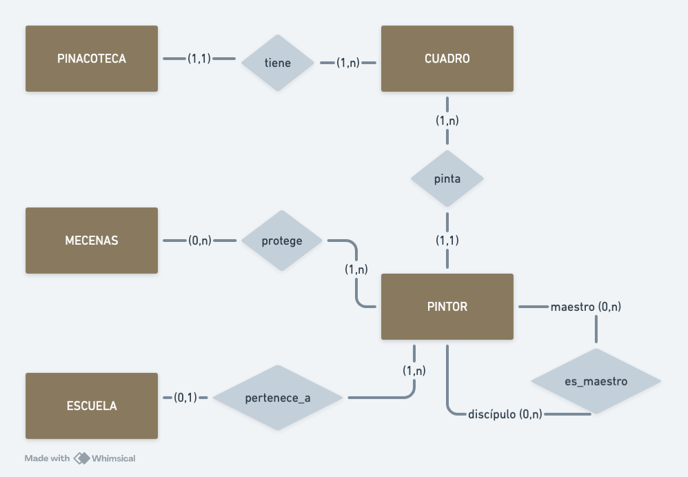
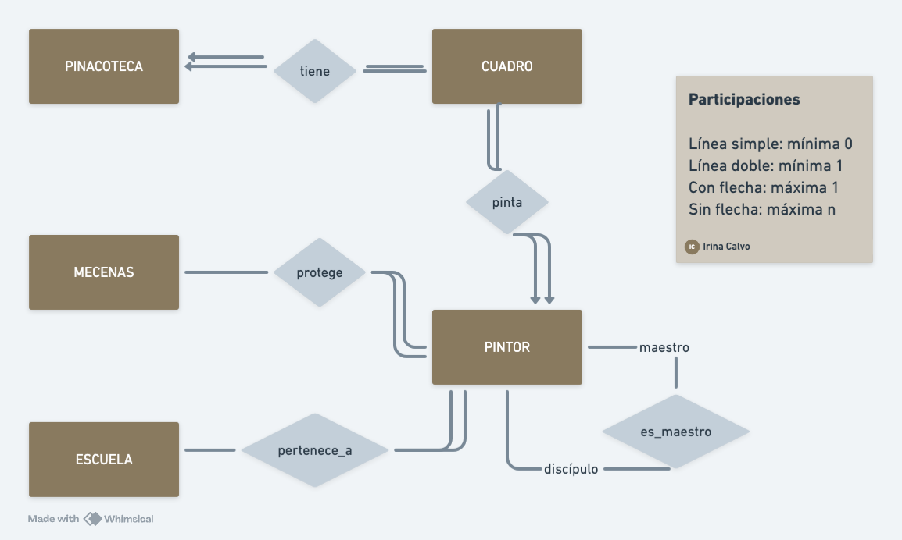
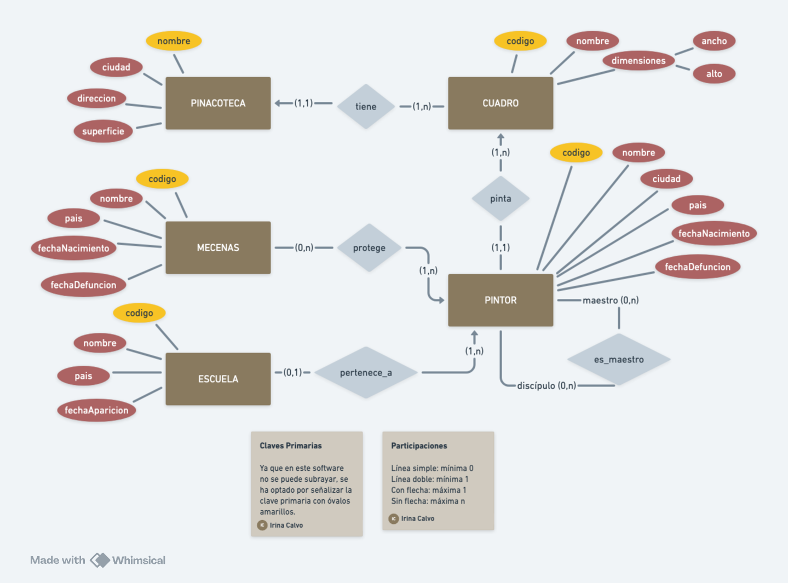
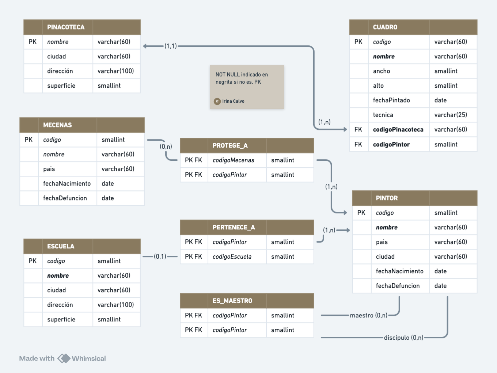

# EJEMPLO PINACOTECA

## *Bases de Datos SQL*

**Irina Calvo**

Máster Big Data, Data Science, Inteligencia Artificial  
Universidad Complutense \- NTIC

# ENUNCIADO

El ministerio encargado de temas culturales de cierto país quiere mantener información acerca de todos los cuadros que se encuentran en sus pinacotecas y toda la información relacionada con ellos. 

De cada pinacoteca se desea saber el nombre (que se supone único) , la ciudad en que se encuentra, la dirección y los metros cuadrados que tiene.

Cada pinacoteca tiene una serie de cuadros de los que quiere mantener información acerca de su código, nombre, dimensiones, fecha en que fue pintado y técnica utilizada.

Cada cuadro es pintado por un determinado pintor (nombre, país, ciudad, fecha de nacimiento y fecha de defunción si procede). Un pintor puede tener a otro como maestro; a su vez, un maestro puede serlo de varios (o de ninguno).

Los pintores pueden pertenecer o no a una escuela de la que se desea saber su nombre y en qué país y en qué fecha apareció.

Los pintores pueden tener también uno o varios mecenas que les protegen (nombre, país, fecha de nacimiento y fecha de defunción si procede). A su vez un mismo mecenas puede serlo de varios pintores.


# DISEÑO ENTIDAD-RELACIÓN

En esta sección se desarrolla el modelo conceptual de la base de datos a trabajar, utilizando un diagrama Entidad-Relación, haciendo uso de la notación Chen para describir entidades, relaciones, atributos, cardinalidades e interdependencias.

El primer diagrama hace uso de la variante original numérica de Peter Chen, presentada por el mismo en su artículo "*The Entity–Relationship Model: Toward a Unified View of Data*" en 1976\.




Este segundo diagrama hace uso de la variante simbólica de Chen:  



Este último diagrama utiliza la variante híbrida de Chen, la cual hemos completado además con los atributos de cada entidad.  



# MODELO RELACIONAL

En esta sección se muestra la conversión, paso a paso, del modelo conceptual desarrollado anteriormente al modelo lógico relacional correspondiente.

## Esquema de base de datos

Pasamos las tablas al esquema, incluyendo las relaciones, descritas en negrita:

pinacoteca ( nombre, ciudad, direccion, superficie )

cuadro ( codigo, nombre, ancho, alto, fechaPintado, tecnica, **codigoPinacoteca**, **codigoPintor** )

pintor ( codigo, nombre, pais, ciudad, fechaNacimiento, fechaDefunción )

mecenas ( codigo, nombre, pais, fechaNacimiento, fechaDefunción )

escuela ( codigo, nombre, pais, fechaAparicion )

**es\_maestro ( codigoMaestro, codigoDiscipulo )**

**protege\_a ( codigoMecenas, codigoPintor )**

**pertenece\_a ( codigoPintor, codigoEscuela )**

## Modelado de tablas

Con esta información, podemos finalizar el modelo relacional de nuestras tablas:



# SCRIPT COMPLETO

Adjunto a este documento se encuentra el archivo en formato SQL llamado **pinacoteca.sql** con el código resultante. También podemos encontrar su contenido en el [repositorio de GitHub](https://github.com/anairinac/ucm-sql/ejemplo/blob/main/ejemplos/pinacoteca/pinacoteca.sql) correspondiente, así como en la siguiente sección:

```sql
/*--------------------------------------------------------------
Proyecto:   Ejemplo Pinacoteca
Archivo:    ejemplos/pinacoteca.sql
Autor:      Irina Calvo
Fecha:      22-10-2025
DB:         MySQL Ver 9.4.0 for macos15 on arm64 (MySQL Community Server \- GPL)
Curso:      Bases de Datos SQL
Programa:   Master Big Data, Data Science, AI
Universidad Complutense
--------------------------------------------------------------*/
-- create database
DROP DATABASE IF EXISTS ejemplo\_pinacoteca; CREATE DATABASE ejemplo\_pinacoteca; USE ejemplo\_pinacoteca;

-- pinacoteca
DROP TABLE IF EXISTS pinacoteca;
CREATE TABLE pinacoteca (
    nombre VARCHAR(60) PRIMARY KEY, 
    ciudad VARCHAR(60), 
    direccion VARCHAR(100), 
    superficie SMALLINT
);

-- escuela
DROP TABLE IF EXISTS escuela;
CREATE TABLE escuela ( 
    codigo SMALLINT PRIMARY KEY AUTO\_INCREMENT, 
    nombre VARCHAR(60), 
    pais VARCHAR(60), 
    fechaAparicion DATE
);

-- mecenas
DROP TABLE IF EXISTS mecenas;
CREATE TABLE mecenas (
    codigo SMALLINT PRIMARY KEY AUTO\_INCREMENT, 
    nombre VARCHAR(60), 
    pais VARCHAR(60), 
    fechaNacimiento DATE, 
    fechaDefunción DATE
);

-- pintor
DROP TABLE IF EXISTS pintor;
CREATE TABLE pintor (
    codigo SMALLINT PRIMARY KEY AUTO\_INCREMENT,
    nombre VARCHAR(60), 
    pais VARCHAR(60), 
    ciudad VARCHAR(60), 
    fechaNacimiento DATE, 
    fechaDefunción DATE
);

-- cuadro
DROP TABLE IF EXISTS cuadro;
CREATE TABLE cuadro (
    codigo SMALLINT PRIMARY KEY AUTO\_INCREMENT, 
    nombre VARCHAR(60), 
    ancho SMALLINT, 
    alto SMALLINT, 
    fechaPintado DATE, 
    tecnica VARCHAR(25), 
    codigoPinacoteca VARCHAR(60) NOT NULL, 
    codigoPintor SMALLINT NOT NULL,
    FOREIGN KEY (codigoPinacoteca) REFERENCES pinacoteca(nombre) ON DELETE CASCADE ON UPDATE CASCADE,
    FOREIGN KEY (codigoPintor) REFERENCES pintor(codigo) ON DELETE CASCADE ON UPDATE CASCADE
);

-- protege_a
DROP TABLE IF EXISTS protege\_a;
CREATE TABLE protege\_a (
    codigoMecenas SMALLINT,
    codigoPintor SMALLINT,
    PRIMARY KEY (codigoMecenas, codigoPintor),
    FOREIGN KEY (codigoMecenas) REFERENCES mecenas(codigo) ON DELETE CASCADE ON UPDATE CASCADE,
    FOREIGN KEY (codigoPintor) REFERENCES pintor(codigo) ON DELETE CASCADE ON UPDATE CASCADE
);

-- pertenece_a
DROP TABLE IF EXISTS pertenece\_a;
CREATE TABLE pertenece\_a (
    codigoPintor SMALLINT,
    codigoEscuela SMALLINT,
    PRIMARY KEY (codigoPintor, codigoEscuela),
    FOREIGN KEY (codigoPintor) REFERENCES pintor(codigo) ON DELETE CASCADE ON UPDATE CASCADE,
    FOREIGN KEY (codigoEscuela) REFERENCES escuela(codigo) ON DELETE CASCADE ON UPDATE CASCADE
);

-- es_maestro
DROP TABLE IF EXISTS es\_maestro;
CREATE TABLE es\_maestro (
    codigoMaestro SMALLINT,
    codigoDiscipulo SMALLINT,
    PRIMARY KEY (codigoMaestro, codigoDiscipulo),
    FOREIGN KEY (codigoMaestro) REFERENCES pintor(codigo) ON DELETE CASCADE,
    FOREIGN KEY (codigoDiscipulo) REFERENCES pintor(codigo) ON DELETE CASCADE ); 
```